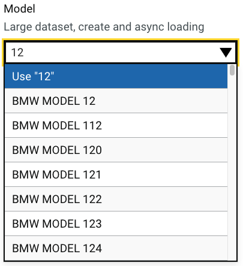

# GOV.UK React Auto Complete User Guide

The GOV.UK Design System is an official design framework produced by the UK Government and defines best practices and rules that must be followed to ensure that your code base is GDS Compliant.

You can find the guide at the <a href="https://design-system.service.gov.uk/" target="_blank" rel="noreferrer">GOV.UK Design System</a> website.

## Overview

The standard implementation for the <a href="https://github.com/alphagov/accessible-autocomplete/" target="_blank" rel="noreferrer">GDS Auto Complete</a> does not support large datasets or the dynamic creation of selectable items.

The remit was to develop an accessible react based auto complete component that would both allow large datasets and the ability to dynamically select an option that was not in the list.

Rather than build the whole component from scratch, two libraries have been utilised. The actual select control uses the <a href="https://react-select.com/home" target="_blank" rel="noreferrer">React Select</a> component which has excellent accessibility support and the ability to create a select control that supports the dynamic creation of items.

The support for large datasets was implemented by overriding the MenuList component of the react select control with a virtual list implementation utilising the <a href="https://tanstack.com/virtual/latest" target="_blank" rel="noreferrer">Tanstack Virtual</a> library.

The resulting component is shown below:



A working ([Demo](https://vite-react-gds-demo.netlify.app/)) can be found under the auto complete menu option, showing two variants, one with a simple list and the second with a large dataset creatable item list.

## Configuration

The below shows one of our example implementations of the auto complete integrated with <a href="https://react-hook-form.com/" target="_blank" rel="noreferrer">React Hook Form</a>:

```js
<Controller
  control={control}
  name="model"
  render={({ field: { value, onChange }, fieldState: { error } }) => (
    <AutoComplete
      identifier="model"
      label="Model"
      labelClassExt="govuk-label-s"
      containerClassExt="govuk-input--width-20"
      hint="Large dataset and create"
      allowCreate={true}
      useUpperCase={true}
      options={vehicleModels}
      value={vehicleModels.find(x => x.value === value)}
      getOptionLabel={x => x.label}
      onChange={x => onChange(x?.value)}
      error={error?.message}
    />
  )}
/>
```

## Installation

The package can be installed via [npm](https://github.com/npm/cli):

```
npm install react-govuk-autocomplete --save
```

Or via [yarn](https://github.com/yarnpkg/yarn):

```
yarn add react-govuk-autocomplete
```

The auto complete uses GDS styles which can be installed via the [govuk-frontend](https://github.com/alphagov/govuk-frontend) package:

```
npm install govuk-frontend --save
yarn add govuk-frontend
```

## License

Copyright (c) 2024 Barry Jacobs and individual contributors. Licensed under MIT license, see [LICENSE](LICENSE) for the full license.
